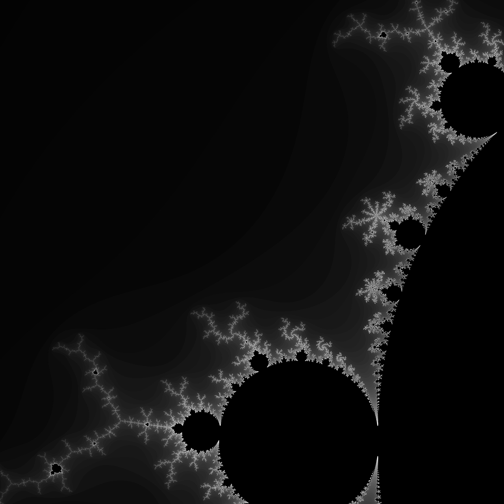

# Parallelized Mandelbrot set generator

**Parallel implementations of Mandelbrot set program, written in a C++ object-oriented approach.**

Different versions :
* serial
* OpenMP
* MPI (master/workers with load-balancing)
* hybrid OpenMP+MPI

Output example, for a limits in the complex plane defined by [-0.2, 0.4] x [0.5, 1.1] :

It is written in a unique source code. The Makefile controls which version is compiled :
* `make srl` for serial version
* `make omp` for OpenMP version
* `make mpi` 
	* with `MPI_SIMPLE` flag for non-load-balanced version (study purpose only)
	* with `MPI_MASTER_WORKERS` flag for load-balancing MPI version
* `make hyb` for hybrid OpenMP+MPI version
* `make` for all.

Limits of the image are defined by macros at the beginning of the `main.cc` file.
Moreover, various macros can be activated in the Makefile : optional optimizations, computations  with `std::complex` instead of standard floating point numbers, use double precision, print a gradient image instead of black/white one, *etc*...